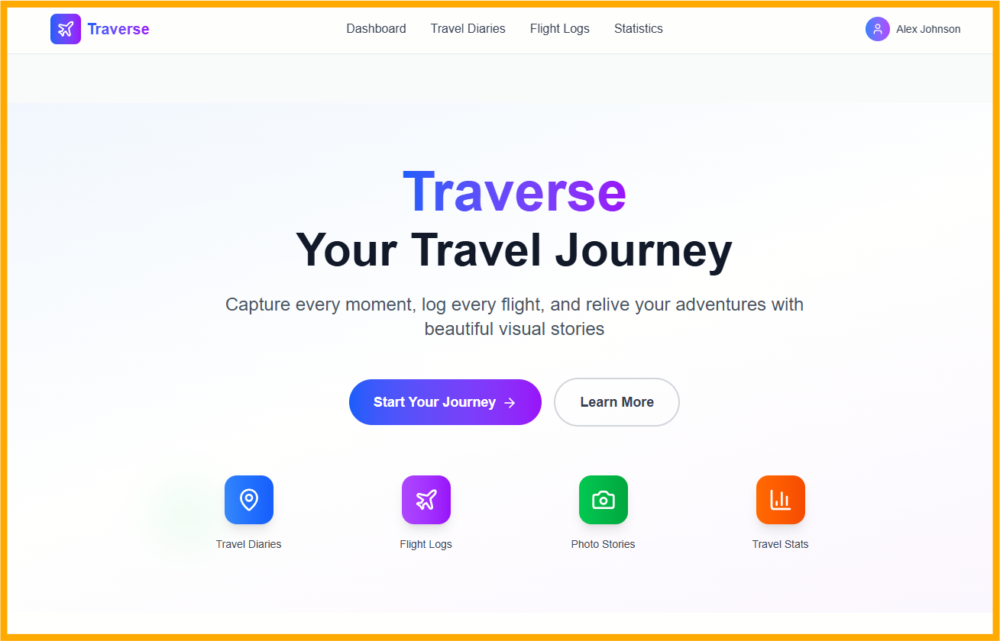
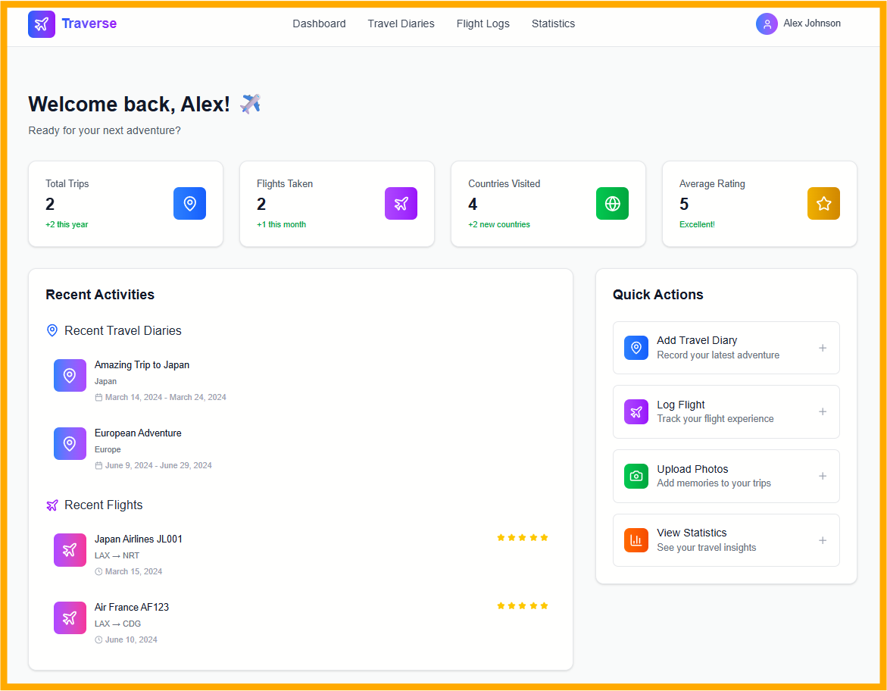

# 🚀 Traverse - Travel Log App

A modern web and mobile application for users to create and manage their travel diaries, flight logs, and travel experiences with beautiful visual representations and dynamic UI animations.

## 📱 App Overview

**Traverse** is a comprehensive travel logging platform that allows users to:
- Create and manage personal travel diaries
- Log flight experiences and travel details
- Share travel memories with beautiful visual representations
- Access their travel history across web and mobile platforms

## 🏗️ Tech Stack

- **Frontend**: Next.js 14 (App Router), React, TypeScript
- **Mobile**: React Native / Expo
- **Backend**: Supabase (Database, Auth, Storage)
- **Styling**: Tailwind CSS, Radix UI, Shadcn UI
- **Authentication**: Supabase Auth, Google OAuth
- **State Management**: React Server Components, Server Actions
- **Deployment**: Vercel (Web), Expo (Mobile)

## 📋 Development Checklist

### 🚀 Phase 1: Project Setup & Foundation

#### Project Initialization
- [x] Initialize Next.js 14 project with TypeScript
- [x] Set up project structure and folder organization
- [x] Configure ESLint, Prettier, and TypeScript
- [x] Set up Git repository and branching strategy
- [x] Create development, staging, and production environments

#### Dependencies & Configuration
- [x] Install and configure Tailwind CSS
- [x] Set up Shadcn UI and Radix UI components
- [x] Configure Supabase client and environment variables
- [x] Set up authentication providers (Google OAuth)
- [x] Install and configure testing libraries (Jest, React Testing Library)

#### Database & Backend Setup
- [x] Set up Supabase project and database
- [x] Design and create database schema
- [x] Set up Row Level Security (RLS) policies
- [x] Create database migrations and seed data
- [x] Set up Supabase Storage for media files

---

### 🔐 Phase 2: Authentication & User Management

#### Authentication System
- [ ] Implement Supabase authentication
- [ ] Add Google OAuth integration
- [ ] Create login/signup forms with validation
- [ ] Implement password reset functionality
- [ ] Add email verification flow
- [ ] Create protected route middleware

#### User Profile Management
- [ ] Design user profile data structure
- [ ] Create profile creation/editing forms
- [ ] Implement profile picture upload
- [ ] Add user preferences and settings
- [ ] Create user dashboard layout

#### Session Management
- [ ] Implement persistent login sessions
- [ ] Add session refresh logic
- [ ] Create logout functionality
- [ ] Handle authentication state across app
- [ ] Add "Remember Me" functionality

---

### 🏠 Phase 3: Core App Structure & Navigation

#### App Layout & Navigation
- [x] Design responsive app layout
- [x] Create navigation components (header, sidebar, footer)
- [x] Implement mobile-responsive navigation
- [x] Add breadcrumb navigation
- [x] Create loading states and skeletons

#### Routing & Pages
- [x] Set up Next.js App Router structure
- [x] Create main page layouts
- [x] Implement dynamic routing for travel entries
- [x] Add 404 and error pages
- [x] Set up page transitions and animations

#### Responsive Design
- [x] Implement mobile-first responsive design
- [x] Create breakpoint-specific layouts
- [x] Test on various device sizes
- [x] Optimize touch interactions for mobile
- [x] Ensure accessibility compliance

---

### ✈️ Phase 4: Travel Logging Features

#### Travel Diary Creation
- [x] Design travel diary data model
- [x] Create diary creation form with validation
- [x] Implement rich text editor for diary entries
- [x] Add date and location pickers
- [x] Create diary entry templates

#### Flight Log Management
- [x] Design flight log data structure
- [x] Create flight logging forms
- [x] Add flight search and autocomplete
- [x] Implement flight tracking features
- [x] Create flight statistics and analytics

#### Media Management
- [x] Set up image upload functionality
- [x] Implement photo gallery for travel entries
- [x] Add image optimization and compression
- [x] Create media organization system
- [x] Implement drag-and-drop upload

---

### 🎨 Phase 5: UI/UX & Visual Design

#### Component Library
- [x] Create reusable UI components
- [x] Implement design system with Tailwind CSS
- [x] Add component variants and states
- [x] Create loading and error states
- [x] Implement accessibility features

#### Visual Representations
- [x] Design travel timeline visualization
- [x] Create interactive maps integration
- [x] Implement travel statistics charts
- [x] Add weather integration for travel dates
- [x] Create travel mood boards

#### Animations & Interactions
- [x] Add page transition animations
- [x] Implement micro-interactions
- [x] Create loading animations
- [x] Add hover and focus effects
- [x] Implement gesture-based interactions

---

### 📱 Phase 6: Mobile App Development

#### React Native Setup
- [ ] Initialize React Native project with Expo
- [ ] Set up mobile-specific dependencies
- [ ] Configure mobile navigation
- [ ] Set up mobile authentication
- [ ] Configure mobile build settings

#### Mobile-Specific Features
- [ ] Implement offline functionality
- [ ] Add push notifications
- [ ] Create mobile-optimized forms
- [ ] Implement mobile camera integration
- [ ] Add location services integration

#### Cross-Platform Sync
- [ ] Ensure data consistency between web and mobile
- [ ] Implement real-time synchronization
- [ ] Handle offline data conflicts
- [ ] Add data migration tools
- [ ] Test cross-platform functionality

---

### 🔄 Phase 7: Real-time Features & Performance

#### Real-time Updates
- [ ] Implement Supabase real-time subscriptions
- [ ] Add live collaboration features
- [ ] Create real-time notifications
- [ ] Implement live data updates
- [ ] Add presence indicators

#### Performance Optimization
- [ ] Implement code splitting and lazy loading
- [ ] Optimize images and media assets
- [ ] Add caching strategies
- [ ] Implement virtual scrolling for large lists
- [ ] Optimize database queries

#### Progressive Web App (PWA)
- [ ] Add service worker for offline functionality
- [ ] Implement app manifest
- [ ] Add push notification support
- [ ] Create install prompts
- [ ] Test PWA functionality

---

### 🧪 Phase 8: Testing & Quality Assurance

#### Unit Testing
- [ ] Write unit tests for utility functions
- [ ] Test React components with React Testing Library
- [ ] Test authentication flows
- [ ] Test form validation logic
- [ ] Achieve minimum 80% test coverage

#### Integration Testing
- [ ] Test API integrations
- [ ] Test database operations
- [ ] Test authentication flows end-to-end
- [ ] Test cross-platform data sync
- [ ] Test real-time features

#### User Testing
- [ ] Conduct usability testing
- [ ] Test on various devices and browsers
- [ ] Gather user feedback
- [ ] Perform accessibility testing
- [ ] Test performance on slow connections

---

### 🚀 Phase 9: Deployment & Production

#### Web App Deployment
- [ ] Set up Vercel deployment pipeline
- [ ] Configure production environment variables
- [ ] Set up custom domain and SSL
- [ ] Configure CDN and caching
- [ ] Set up monitoring and analytics

#### Mobile App Deployment
- [ ] Configure Expo build settings
- [ ] Set up app store deployment
- [ ] Create app store listings
- [ ] Configure mobile analytics
- [ ] Set up crash reporting

#### Production Monitoring
- [ ] Implement error tracking (Sentry)
- [ ] Set up performance monitoring
- [ ] Configure logging and alerting
- [ ] Set up uptime monitoring
- [ ] Implement user analytics

---

### 📊 Phase 10: Post-Launch & Maintenance

#### Analytics & Insights
- [ ] Set up Google Analytics
- [ ] Implement user behavior tracking
- [ ] Create performance dashboards
- [ ] Set up conversion tracking
- [ ] Monitor key performance indicators

#### User Support
- [ ] Create help documentation
- [ ] Implement in-app support chat
- [ ] Set up feedback collection system
- [ ] Create user onboarding flow
- [ ] Implement feature request system

#### Continuous Improvement
- [ ] Set up automated testing pipeline
- [ ] Implement continuous deployment
- [ ] Create feature flag system
- [ ] Set up A/B testing framework
- [ ] Plan regular update cycles

---

## 🛠️ Development Commands

```bash
# Install dependencies
npm install

# Run development server
npm run dev

# Build for production
npm run build

# Run tests
npm run test

# Run linting
npm run lint

# Run type checking
npm run type-check
```

## 🌐 Environment Variables

Create a `.env.local` file with the following variables:

```env
# Supabase (for future use)
NEXT_PUBLIC_SUPABASE_URL=your_supabase_url
NEXT_PUBLIC_SUPABASE_ANON_KEY=your_supabase_anon_key

# App Configuration
NEXT_PUBLIC_APP_URL=http://localhost:3000
NEXT_PUBLIC_APP_NAME=Traverse

# Mock Data Mode
NEXT_PUBLIC_USE_MOCK_DATA=true
```

## 📁 Project Structure

```
traverse/
├── app/                    # Next.js App Router
│   ├── (auth)/            # Authentication routes
│   ├── (dashboard)/       # Protected dashboard routes
│   ├── api/               # API routes
│   └── globals.css        # Global styles
├── components/             # Reusable components
│   ├── ui/                # Shadcn UI components
│   ├── forms/             # Form components
│   └── layout/            # Layout components
├── lib/                    # Utility functions
├── types/                  # TypeScript type definitions
├── hooks/                  # Custom React hooks
├── services/               # API and external services
├── styles/                 # Additional styles
└── public/                 # Static assets
```

## 🔧 Development Guidelines

- Follow TypeScript best practices
- Use React Server Components when possible
- Implement proper error handling and validation
- Write comprehensive tests for all features
- Follow accessibility guidelines (WCAG 2.1)
- Use semantic HTML and proper ARIA labels
- Implement responsive design principles
- Follow security best practices

## 📚 Resources & Documentation

- [Next.js Documentation](https://nextjs.org/docs)
- [Supabase Documentation](https://supabase.com/docs)
- [Tailwind CSS Documentation](https://tailwindcss.com/docs)
- [Shadcn UI Documentation](https://ui.shadcn.com/)
- [React Native Documentation](https://reactnative.dev/)

## 🤝 Contributing

1. Fork the repository
2. Create a feature branch
3. Make your changes
4. Add tests for new functionality
5. Ensure all tests pass
6. Submit a pull request

## 📄 License

This project is licensed under the MIT License.

---

**Happy Traveling! ✈️🌍**

*Check off items as you complete them to track your progress!*

## 🎉 Current Status

**✅ Phase 1: COMPLETED** - Project foundation is ready!
**✅ Phase 3: COMPLETED** - Core app structure and navigation working!
**✅ Phase 4: COMPLETED** - Travel logging features with mock data!
**✅ Phase 5: COMPLETED** - Modern UI with animations!

**🚀 Your Traverse app is now running locally with:**
- Beautiful modern UI with Framer Motion animations
- Responsive design for all devices
- Mock data for travel diaries and flight logs
- Dashboard with statistics and recent activities
- Hero section with call-to-action
- Features showcase
- Navigation header with user menu

**🌐 Access your app at: http://localhost:3000**


### 🎨 Phase 1 Completed Features Showcase

## 📸 App Screenshots & Visuals


*Traverse Homepage - Hero section with navigation and feature overview*


*Traverse Dashboard - Main interface with statistics, recent activities, and quick actions*

